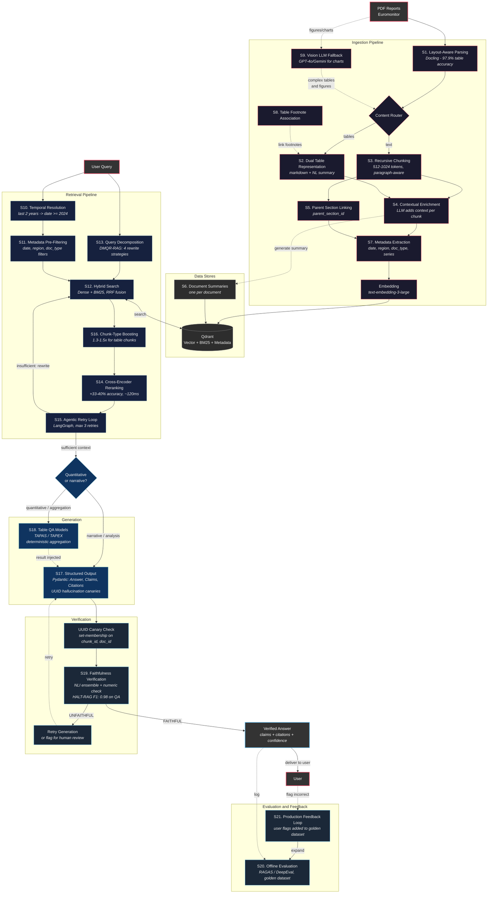

# RAG Architecture for Market Research Intelligence

> Items marked with **[T]** are explicitly stated in the task. Items without the marker are other possible causes/solutions.

## Failure Modes

The baseline RAG pipeline fails in four ways **[T]**:

| #   | Failure Mode                                                                             | Example                                                                                                             | Causes                                                |
| --- | ---------------------------------------------------------------------------------------- | ------------------------------------------------------------------------------------------------------------------- | ----------------------------------------------------- |
| F1  | Fails to find and connect relevant information scattered across multiple reports **[T]** | A conclusion on page 5 references supporting data on page 2 **[T]**; answer requires combining two separate reports | [6 causes →](#f1-information-fragmentation)       |
| F2  | Retrieves outdated documents, ignoring publication dates **[T]**                         | Returns a 2018 document when the user asks about "the last 2 years" **[T]**                                         | [7 causes →](#f2-temporal-and-metadata-blindness) |
| F3  | Tables and structured data treated as garbled text **[T]**                               | Multi-column layouts and embedded tables **[T]**; table rows become unreadable number sequences                     | [6 causes →](#f3-structural-data-loss)            |
| F4  | LLM hallucinates — confident but incorrect answers without citing sources **[T]**        | Generates plausible-sounding statistics that don't exist in any source document                                     | [8 causes →](#f4-hallucination-and-groundedness)  |

---

## Root Causes

Each failure mode might have multiple underlying causes. A single "fix" per failure mode leaves the others unaddressed.

### F1 Information Fragmentation
[↑ back to failure modes](#failure-modes)

| # | Cause | Why it happens |
|---|-------|---------------|
| C1.1 | **Chunking breaks cross-references** **[T]** | Fixed-size splitting cuts between a conclusion (page 5) and its supporting data (page 2). The chunk containing the conclusion has no access to the evidence. |
| C1.2 | **Isolated chunks lose document context** | A chunk saying "revenue increased 15%" is meaningless without knowing which company, which year, which market. The embedding is ambiguous, retrieval is imprecise. |
| C1.3 | **Single query can't capture multi-faceted questions** **[T]** | "How has Gen Z's perception of sustainable packaging changed in the EU vs. the US?" **[T]** touches 3+ aspects. A single embedding averages them into a blurry vector that retrieves none well. |
| C1.4 | **Cross-document synthesis required** | The answer lives in Report A (market size data) + Report B (consumer survey) + Report C (regional breakdown). No single retrieval pass finds all three. |
| C1.5 | **Implicit references become meaningless** | "As shown in the previous section", "the aforementioned trend" — these are common in research reports and become dangling pointers when extracted as standalone chunks. |
| C1.6 | **Vocabulary mismatch between query and documents** | User says "eco-friendly containers", document says "sustainable packaging". Dense retrieval catches some of this, but not all — especially for domain-specific jargon. |

### F2 Temporal and Metadata Blindness
[↑ back to failure modes](#failure-modes)

| # | Cause | Why it happens |
|---|-------|---------------|
| C2.1 | **Cosine similarity has no concept of time** **[T]** | Embeddings encode semantic meaning, not metadata. A 2018 document about "sustainable packaging trends" is semantically identical to a 2024 one. |
| C2.2 | **Temporal expressions are unresolved** **[T]** | "Last 2 years" **[T]**, "recent", "Q3 2025" — the system doesn't convert these to absolute date ranges before retrieval. |
| C2.3 | **No metadata filtering at retrieval time** | Even if the system knows the date, it doesn't use publication_date as a pre-filter. Old documents compete equally with new ones for top-K slots. |
| C2.4 | **Recency bias absent** | When two documents are equally relevant semantically, the user almost always wants the newer one. The system has no mechanism to prefer recent data. |
| C2.5 | **Entity ambiguity** | "Apple" (fruit vs company), "Mercury" (planet vs chemical) — embeddings average the meanings, retrieving wrong-domain documents. Regional terms ("the South") are similarly ambiguous without metadata context. |
| C2.6 | **Negation blindness** | "Countries that did NOT adopt sustainable packaging" has nearly identical embeddings to "countries that adopted sustainable packaging". Dense retrieval can't distinguish negation. |
| C2.7 | **Quantitative reasoning impossible via embeddings** | "Markets with growth above 10%" — no embedding captures numeric thresholds. This requires structured metadata queries, not vector similarity. |

### F3 Structural Data Loss
[↑ back to failure modes](#failure-modes)

| # | Cause | Why it happens |
|---|-------|---------------|
| C3.1 | **Naive text extraction reads left-to-right, top-to-bottom** **[T]** | Multi-column layouts **[T]** get interleaved. Column A line 1 merges with Column B line 1, producing nonsense. |
| C3.2 | **Table structure destroyed** **[T]** | Row/column relationships lost. "EU | 31% | 54%" becomes "EU 31 54" — no way to know which number means what. |
| C3.3 | **Merged cells, multi-level headers, spanning rows** | Complex table structures (common in market research) break even basic table extraction. A cell spanning 3 columns becomes misaligned with its row data. |
| C3.4 | **Figures and charts contain data not present as text** | Bar charts, pie charts, infographics — the actual numbers may only exist visually, never appearing in extractable text. |
| C3.5 | **Footnotes and annotations disconnected from their tables** | "* Adjusted for inflation" at the bottom of the page gets separated from the table it annotates. The numbers are meaningless without the footnote. |
| C3.6 | **Tables embed poorly as vectors** | Even when correctly extracted, tabular data ("EU | 31% | 54% | 2024") doesn't produce meaningful embeddings. Semantic search can't match "what was the EU adoption rate?" to a row of numbers. |

### F4 Hallucination and Groundedness
[↑ back to failure modes](#failure-modes)

| # | Cause | Why it happens |
|---|-------|---------------|
| C4.1 | **No grounding mechanism** **[T]** | The LLM generates from its training data when retrieved context is insufficient, producing plausible-sounding but fabricated information. |
| C4.2 | **Retrieval failure upstream** | If the wrong chunks are retrieved (due to F1/F2/F3), even perfect grounding produces wrong answers. Output quality is bounded by retrieval quality. |
| C4.3 | **Multi-chunk synthesis errors** | LLM reads Chunk A ("EU market grew 15%") and Chunk B ("US market is $2B") correctly, but draws an invalid conclusion combining them ("EU market is $2.3B" — nowhere stated). |
| C4.4 | **Temporal blending** | Retrieves a 2022 report and a 2024 report, blends their numbers without distinguishing which year each comes from. The answer mixes outdated and current data. |
| C4.5 | **Overconfidence on partial information** | Retrieves 2 of 5 relevant chunks. Generates a complete-sounding answer from incomplete evidence, without signaling that information may be missing. |
| C4.6 | **Numeric hallucination** | Numeric errors are the highest-risk hallucination type in market research. "Revenue grew 23%" vs "Revenue grew 32%" — both are plausible, and NLI models can't catch the difference. |
| C4.7 | **Conflicting sources** | Two reports disagree (different methodologies, different time periods). The LLM picks one arbitrarily or blends them, without surfacing the contradiction. |
| C4.8 | **No citation enforcement** **[T]** | Without a structural requirement to cite sources, the model has no incentive to stay within the retrieved context. It freely mixes retrieval with parametric knowledge. |

---

## Solutions

Each solution addresses one or more root causes. Solutions are grouped by where they operate in the pipeline.

### Architecture Overview



### Ingestion-Time Solutions

| Solution | Addresses | Description |
|----------|-----------|-------------|
| **[S1. Layout-aware parsing](#s1-layout-aware-parsing)** | C3.1, C3.2, C3.3 | Use a structure-aware parser (Docling, LlamaParse) that detects columns, tables, headers, and reading order before text extraction. |
| **[S2. Dual table representation](#s2-dual-table-representation)** | C3.2, C3.6 | Store each table as both (a) structured markdown preserving rows/columns for generation, and (b) a natural language summary for retrieval. |
| **[S3. Recursive paragraph-aware chunking](#s3-recursive-paragraph-aware-chunking)** | C1.1, C1.5 | Split at paragraph/sentence boundaries respecting document structure (512-1024 tokens). Preserve section hierarchy. Overlap not recommended by default — contextual enrichment (S4) and parent linking (S5) solve context loss more effectively [^chroma-chunking]. |
| **[S4. Contextual enrichment](#s4-contextual-enrichment)** | C1.2, C1.5, C1.6 | Prepend each chunk with document title, section heading, and a brief LLM-generated context sentence before embedding. Turns ambiguous chunks into self-contained units. |
| **[S5. Parent section linking](#s5-parent-section-linking)** | C1.1 | Each chunk stores a `parent_section_id`. At generation time, retrieve the small chunk for precision, expand to the full parent section for context. |
| **[S6. Document summaries](#s6-document-summaries)** | C1.4, C4.5 | Generate a summary per document capturing the overall narrative. Stored as a separate searchable chunk. Enables cross-document discovery for broad questions. |
| **[S7. Metadata extraction](#s7-metadata-extraction)** | C2.1, C2.3, C2.4 | Extract and store publication_date, region, document_type, report_series as structured metadata fields at indexing time. |
| **[S8. Table footnote association](#s8-table-footnote-association)** | C3.5 | During parsing, link footnotes/annotations to their parent table. Store them together as a single unit. |
| **[S9. Vision LLM fallback for figures](#s9-vision-llm-fallback)** | C3.4, C3.3 | For charts/figures/complex tables where text extraction fails, pass the page image through a vision LLM (GPT-4o, Gemini) to extract data. Fallback, not primary path — slower and costlier. |

### Retrieval-Time Solutions

| Solution | Addresses | Description |
|----------|-----------|-------------|
| **[S10. Temporal resolution](#s10-temporal-resolution)** | C2.2 | Before retrieval, resolve temporal expressions ("last 2 years" → `date >= 2024-03-13`, "Q3 2025" → date range) via LLM call or regex rules. |
| **[S11. Metadata pre-filtering](#s11-metadata-pre-filtering)** **[T]** | C2.1, C2.3, C2.4, C2.5 | Beyond simple cosine similarity **[T]**: apply resolved date ranges, regions, document types as pre-filters at the vector DB level. Old/irrelevant documents excluded before similarity ranking, not after. |
| **[S12. Hybrid search (dense + BM25)](#s12-hybrid-search)** **[T]** | C1.6, C2.6 | Beyond simple cosine similarity **[T]**: run parallel dense (semantic) and sparse (keyword) retrieval, fuse via Reciprocal Rank Fusion. Dense catches paraphrases; BM25 catches exact terms, product names, report IDs, and handles negation better. |
| **[S13. Query decomposition](#s13-query-decomposition)** | C1.3, C1.4 | LLM classifies query complexity. Complex queries decomposed into 2-4 focused sub-queries, each retrieving independently. Results merged before reranking. |
| **[S14. Cross-encoder reranking](#s14-cross-encoder-reranking)** **[T]** | C1.6, C2.5, C2.6 | Beyond simple cosine similarity **[T]**: top-50 candidates re-scored by a cross-encoder that processes query + document together. Catches fine-grained relevance that bi-encoders miss. |
| **[S15. Agentic retry loop](#s15-agentic-retry-loop)** **[T]** | C1.4, C4.2, C4.5 | After retrieval, LLM evaluates sufficiency. If context is insufficient, rewrites the query targeting missing information **[T]**. Capped at 2-3 retries. |
| **[S16. Chunk-type boosting](#s16-chunk-type-boosting)** | C3.6 | When the query asks for quantitative data ("what percentage", "how many"), boost table-type chunks in retrieval scoring. |

### Generation-Time Solutions

| Solution | Addresses | Description |
|----------|-----------|-------------|
| **[S17. Structured output with citation enforcement](#s17-structured-output-with-citation-enforcement)** **[T]** | C4.1, C4.4, C4.5, C4.7, C4.8 | Pydantic schema (`Answer → Claims → Citations`) enforced via structured output (BAML, Instructor, or provider-native). Every claim requires citations with UUIDs (hallucination canaries), `publication_date` (temporal attribution), and `conflicts_with` (conflict surfacing) **[T]**. |
| **[S18. Table QA models](#s18-table-qa-models)** | C4.6, C4.3, C3.6 | For quantitative table questions, route through a specialized table QA model (TAPAS, TAPEX) that selects cells and computes aggregations directly — avoids LLM math errors entirely. |

### Verification-Time Solutions

| Solution | Addresses | Description |
|----------|-----------|-------------|
| **[S19. Faithfulness verification](#s19-faithfulness-verification)** **[T]** | C4.1, C4.3, C4.6 | Separate LLM call or NLI model checks each claim against its cited chunk. Includes numeric verification via regex for quantitative claims. Measures and improves groundedness **[T]**. |
| **[S20. Offline evaluation (golden dataset)](#s20-offline-evaluation)** **[T]** | C4.2, C4.5 | Curated Q&A pairs with known correct answers. Run automated retrieval + generation metrics (RAGAS/DeepEval) on every prompt/model change. Measures groundedness **[T]**. Catches regression. |
| **[S21. Production feedback loop](#s21-production-feedback-loop)** | All | User-flagged incorrect answers added to golden dataset. Highest-signal evaluation data — real queries where real users identified errors. |

---

## Cause-Solution Traceability

Every root cause maps to at least one solution. Every solution maps to at least one cause.

| Cause | Solutions |
|-------|-----------|
| C1.1 Chunking breaks cross-references | [S3](#s3-recursive-paragraph-aware-chunking), [S5](#s5-parent-section-linking) |
| C1.2 Chunks lose document context | [S4](#s4-contextual-enrichment) |
| C1.3 Single query can't capture multi-faceted questions | [S13](#s13-query-decomposition) |
| C1.4 Cross-document synthesis required | [S6](#s6-document-summaries), [S13](#s13-query-decomposition), [S15](#s15-agentic-retry-loop) |
| C1.5 Implicit references become meaningless | [S3](#s3-recursive-paragraph-aware-chunking), [S4](#s4-contextual-enrichment) |
| C1.6 Vocabulary mismatch | [S4](#s4-contextual-enrichment), [S12](#s12-hybrid-search), [S14](#s14-cross-encoder-reranking) |
| C2.1 Cosine similarity ignores time | [S7](#s7-metadata-extraction), [S11](#s11-metadata-pre-filtering) |
| C2.2 Temporal expressions unresolved | [S10](#s10-temporal-resolution) |
| C2.3 No metadata filtering | [S7](#s7-metadata-extraction), [S11](#s11-metadata-pre-filtering) |
| C2.4 No recency preference | [S7](#s7-metadata-extraction), [S11](#s11-metadata-pre-filtering) |
| C2.5 Entity ambiguity | [S11](#s11-metadata-pre-filtering), [S14](#s14-cross-encoder-reranking) |
| C2.6 Negation blindness | [S12](#s12-hybrid-search), [S14](#s14-cross-encoder-reranking) |
| C2.7 Quantitative reasoning impossible via embeddings | *(Known gap — requires structured metadata queries; see [Known Gaps](#known-gaps))* |
| C3.1 Naive extraction interleaves columns | [S1](#s1-layout-aware-parsing) |
| C3.2 Table structure destroyed | [S1](#s1-layout-aware-parsing), [S2](#s2-dual-table-representation) |
| C3.3 Complex table structures break extraction | [S1](#s1-layout-aware-parsing), [S9](#s9-vision-llm-fallback) |
| C3.4 Figure/chart data not in text | [S9](#s9-vision-llm-fallback) |
| C3.5 Footnotes disconnected from tables | [S8](#s8-table-footnote-association) |
| C3.6 Tables embed poorly | [S2](#s2-dual-table-representation), [S16](#s16-chunk-type-boosting), [S18](#s18-table-qa-models) |
| C4.1 No grounding mechanism | [S17](#s17-structured-output-with-citation-enforcement), [S19](#s19-faithfulness-verification) |
| C4.2 Retrieval failure upstream | [S15](#s15-agentic-retry-loop), [S20](#s20-offline-evaluation) |
| C4.3 Multi-chunk synthesis errors | [S19](#s19-faithfulness-verification), [S18](#s18-table-qa-models) |
| C4.4 Temporal blending | [S17](#s17-structured-output-with-citation-enforcement) (`publication_date` field) |
| C4.5 Overconfidence on partial information | [S6](#s6-document-summaries), [S15](#s15-agentic-retry-loop), [S17](#s17-structured-output-with-citation-enforcement), [S20](#s20-offline-evaluation) |
| C4.6 Numeric hallucination | [S19](#s19-faithfulness-verification), [S18](#s18-table-qa-models) |
| C4.7 Conflicting sources | [S17](#s17-structured-output-with-citation-enforcement) (`conflicts_with` field) |
| C4.8 No citation enforcement | [S17](#s17-structured-output-with-citation-enforcement) |

---

## Detailed Solutions

### Ingestion-Time Solutions

#### S1. Layout-Aware Parsing
**Addresses:** C3.1 (column interleaving), C3.2 (table destruction), C3.3 (complex table structures)
[↑ back to solutions](#solutions)

Standard text extractors (PyPDF2, pdfminer) read characters left-to-right, top-to-bottom. Multi-column layouts get interleaved and tables become number salad. A layout-aware parser detects page structure — columns, headers, footers, tables, figures — and linearizes text into proper reading order before extraction.

**Parser comparison:**

| Parser | Table Accuracy | Speed | Open Source | Notes |
|--------|---------------|-------|-------------|-------|
| **Docling (IBM)** | 97.9% complex tables | ~6s/page (6.28s for 1pg, 65s for 50pg — linear scaling) [^docling-benchmark-speed] | Yes | Best structural preservation [^docling-benchmark] ("highest fidelity on multi-row, multi-column tables with merged cells") |
| **LlamaParse** | ~95% | ~6s/doc regardless of size (flat scaling) [^llamaparse-benchmark] | No (API) | Agentic OCR adapts to document types. Constant time because processing is server-side with parallelization. |
| **Unstructured.io** | 75% complex, 100% simple | ~51s for 1pg, ~141s for 50pg (slow, irregular scaling) [^docling-benchmark-speed] | Yes | Good pipeline automation, weaker on complex tables [^docling-benchmark] |
| **Azure Doc Intelligence** | Moderate | Not benchmarked | No | Azure-locked. Struggles with complex layouts. |

**Chosen: Docling** — 97.9% vs Unstructured's 75% on complex tables [^docling-benchmark]. For market research reports full of data tables, this accuracy gap is the difference between "EU adoption grew from 31% to 54%" and garbled numbers.

**Alternatives considered:**

- **Unstructured.io:** Better pipeline automation and integration ecosystem, but 75% on complex tables is not acceptable when clients need precise quantitative data [^docling-benchmark].
- **LlamaParse:** Fastest option (~6s/doc), API-based (no self-hosting). Good accuracy (~95%), but proprietary and adds external dependency. Worth evaluating if processing speed is critical.

**Drawbacks:**
- No parser is 100% accurate. Need a fallback for garbled extractions — flagging low-confidence parses for human review or re-processing with a vision LLM ([S9](#s9-vision-llm-fallback)).

---

#### S2. Dual Table Representation
**Addresses:** C3.2 (table structure destroyed), C3.6 (tables embed poorly)
[↑ back to solutions](#solutions)

Even when correctly extracted, tabular data ("EU | 31% | 54% | 2024") doesn't produce meaningful embeddings. Semantic search can't match "what was the EU adoption rate?" to a row of numbers.

Store each table in two forms:

1. **Markdown/CSV** — preserves row/column structure so the LLM can reason over exact values ("Row 3, EU, 23.4%")
2. **Natural language summary** — embeds well for semantic search (e.g. "Table shows sustainable packaging adoption rates by age group in EU countries from 2022-2024")

**Why both?** They serve different purposes. The NL summary is for *retrieval* (finding the right table). The markdown is for *generation* (giving the LLM exact numbers to cite). When the NL summary is retrieved, the associated markdown table is pulled alongside it.

**Drawbacks:**
- NL summaries require an LLM call per table. **Mitigation:** batch with cheap model (GPT-4o-mini, Claude Haiku). A market research report might have 5-20 tables, so 50K docs → 250K-1M table summary calls — significant but one-time.
- Dual representation doubles chunk count for table-heavy documents, increasing storage and retrieval noise. **Mitigation:** chunk-type filtering ([S16](#s16-chunk-type-boosting)) prevents table markdown chunks from crowding out text chunks.

---

#### S3. Recursive Paragraph-Aware Chunking
**Addresses:** C1.1 (chunking breaks cross-references), C1.5 (implicit references)
[↑ back to solutions](#solutions)

Split at paragraph and sentence boundaries, respecting document structure. Target 512-1024 tokens per chunk. Section titles preserved as metadata.

Recursive 512-token splitting achieved **69% accuracy** in a benchmark across 50 academic papers, outperforming semantic chunking at 54% [^chunking-benchmark] ("recursive splitting at paragraph boundaries maintains topical coherence while keeping chunks small enough for precise retrieval").

**On overlapping windows:** A common recommendation is 10-20% overlap between adjacent chunks to preserve cross-boundary references. However, Chroma's chunking evaluation found that removing overlap consistently *improved* precision and IoU scores — 400-token chunks went from 3.3% to 3.6% precision without overlap [^chroma-chunking] ("reducing chunk overlap improves IoU scores, as this metric penalizes redundant information"). Overlap increases index size and retrieval noise without clear recall gains. Given that [S4](#s4-contextual-enrichment) and [S5](#s5-parent-section-linking) already solve the context-loss problem more effectively, overlap is not recommended as a default — start without it, add only if evaluation shows boundary-splitting issues.

**Alternatives considered:**

- **Semantic chunking (split by embedding similarity shifts):** Splits where the topic changes, detected by embedding similarity drops between sentences. In practice, benchmarks show it produces fragments averaging only 43 tokens [^chunking-benchmark] ("semantic chunking over-segments text, producing many tiny fragments that lack sufficient context for meaningful embeddings"). A NAACL 2025 study found fixed 200-word chunks matched or beat it across retrieval and generation tasks [^naacl-chunking] ("the computational overhead of computing embeddings for every sentence pair during chunking is not justified by consistent retrieval improvements"). Rejected.
- **Long context without chunking (stuff full documents):** With 200K+ token windows, this seems viable. But 50K documents x ~5 pages each = ~500M tokens. Even the largest context window fits ~400 pages. RAG remains essential for corpora above ~200K total tokens [^long-context-vs-rag] ("for corpora exceeding a few hundred pages, retrieval-augmented generation consistently outperforms long-context stuffing in both accuracy and cost"). Long context helps *after* retrieval — fitting more retrieved chunks into the generation call — but does not replace chunking at this scale.

---

#### S4. Contextual Enrichment
**Addresses:** C1.2 (chunks lose context), C1.5 (implicit references), C1.6 (vocabulary mismatch)
[↑ back to solutions](#solutions)

Before embedding, prepend each chunk with contextual information so that the embedding captures *what this chunk is about* rather than just its isolated text. A chunk saying "revenue increased 15%" is ambiguous — prepending "From Acme Corp Q3 2024 Annual Report, Revenue Analysis section" makes the embedding specific and retrievable.

Anthropic's contextual retrieval approach reduces retrieval failures by up to **67%** [^anthropic-contextual] ("an isolated chunk like 'revenue increased 15%' is ambiguous — prepending context makes the embedding far more specific and retrievable"). Among ingestion-time solutions, this yields the largest retrieval accuracy gain relative to cost.

**Tiered approach — not every chunk needs an LLM call:**

| Tier | When | Method | Cost |
|------|------|--------|------|
| 1. Algorithmic | Always | Prepend `doc_title + section_heading` from parsed document structure (already extracted in [S1](#s1-layout-aware-parsing)). Pure string concatenation. | Free |
| 2. LLM-generated | When headers are uninformative ("Table 4", "Section 3.2", "Appendix", or missing entirely) | LLM generates a context sentence: "This table shows sustainable packaging adoption rates by country in the EU, 2022-2024." | ~$0.01/chunk |

Tier 1 alone solves most of the ambiguity — most market research reports have descriptive section titles. Tier 2 is only needed when the header doesn't convey meaning. A simple heuristic or lightweight classifier can decide whether a header is informative: e.g. flag headers shorter than 4 words, generic patterns ("Table N", "Section N.N", "Appendix"), or chunks with no parent header at all. This could reduce LLM calls from ~1M to ~100-200K (only the ambiguous chunks).

**Alternatives considered:**

- **LLM call for every chunk (Anthropic's original approach):** Simpler to implement — no routing logic. The 67% error reduction benchmark [^anthropic-contextual] was measured with this approach. But at 50K documents (~500K-2M chunks), this means $5K-20K in LLM costs (at ~$0.01/chunk with GPT-4o-mini or Claude Haiku). The tiered approach captures most of the benefit at a fraction of the cost.
- **Late chunking (embed full document, then pool into chunks):** Preserves document-level context in embeddings without any LLM calls — cheapest at indexing time [^late-interaction-weaviate] ("late chunking processes the full document through the embedding model, then pools token embeddings into chunks, preserving long-range context"). But contextual retrieval has stronger benchmarks (67% error reduction [^anthropic-contextual]) and is simpler to implement. Worth revisiting if indexing LLM costs become a bottleneck.

**Drawbacks:**
- The tiered approach requires a decision boundary for "informative vs uninformative" headers. A misclassified informative header might get an unnecessary LLM call (wasted cost but no harm), while a misclassified uninformative header stays ambiguous (potential retrieval degradation). Err on the side of calling the LLM when uncertain.
- The 67% benchmark was measured with full LLM enrichment. The tiered approach may achieve somewhat less improvement, though no benchmark exists for the tiered variant specifically.

---

#### S5. Parent Section Linking
**Addresses:** C1.1 (chunking breaks cross-references)
[↑ back to solutions](#solutions)

Each chunk stores a `parent_section_id`. When a chunk is retrieved, the full parent section is pulled for the LLM — retrieve small for precision, generate with large for context.

This directly addresses the page 2/page 5 problem: if the conclusion and supporting data are in the same section, parent expansion brings them together. Retrieve the 512-token chunk (precise match), but feed the LLM the full 2000-4000 token section (complete context).

**Why not expand to the full document?** A market research report is 20-50 pages (~10K-25K tokens). When retrieving 5-10 chunks from different documents, expanding each to its full document means 50K-250K tokens — likely exceeding the context window. Even if it fits, most of the document is irrelevant, which triggers the "lost in the middle" problem (LLMs are worse at using information buried in long contexts), and cost scales linearly with input tokens.

**Context expansion strategies compared:**

| Strategy | Context size | Tradeoff |
|----------|-------------|----------|
| Chunk only | 512-1024 tokens | Highest retrieval precision, but may miss surrounding context |
| **Parent section** (chosen) | ~2000-4000 tokens | Good balance — captures most intra-section cross-references |
| Sibling chunks (N-1, N, N+1) | ~1500-3000 tokens | Cheaper than parent expansion, catches immediate boundary context. LlamaIndex's `SentenceWindowNodeParser` does this. |
| Chunk + document summary | ~1000-2000 tokens | Specific chunk for detail + summary ([S6](#s6-document-summaries)) for big-picture context. Cheap and effective. |
| Full document | ~10K-25K tokens | All context available but diluted with irrelevance. Expensive. Only viable if retrieving from 1-2 documents. |

**Other context-recovery approaches:**

- **Multi-hop retrieval:** If chunk A references "as shown in Section 3", the agentic retry loop ([S15](#s15-agentic-retry-loop)) detects the missing reference and retrieves Section 3 in a follow-up query. Handles cross-section references without expanding context upfront.
- **Hierarchical retrieval:** Retrieve simultaneously at chunk-level, section-level, and summary-level. Merge and deduplicate before passing to generation. Gives the LLM context at every granularity, but increases retrieval cost.

**Recommended combination:** Parent section expansion as the default, supplemented by document summaries ([S6](#s6-document-summaries)) for broad context and the retry loop ([S15](#s15-agentic-retry-loop)) for cross-section references that parent expansion misses.

**Drawbacks:**
- Assumes sections are meaningful units. If a document has no clear section structure (some PDFs are flowing text), fallback to sibling chunk expansion (N-1, N, N+1).
- Parent sections can vary wildly in size (500 to 5000+ tokens). Very large sections may need truncation or sub-section selection to stay within token budgets.

---

#### S6. Document Summaries
**Addresses:** C1.4 (cross-document synthesis), C4.5 (overconfidence on partial information)
[↑ back to solutions](#solutions)

Each document gets a generated summary stored as a separate searchable chunk. Captures the overall narrative, cross-section relationships, and key findings that individual chunks miss.

When a user asks a broad question ("What are the trends in sustainable packaging?"), summary chunks have higher relevance than any single detail chunk. They also help the retrieval system find documents that contribute partial information to multi-document answers.

**Alternatives considered:**

- **RAPTOR (recursive abstractive tree of summaries):** Builds a hierarchy of clustered summaries via recursive LLM calls. GPT-4 + RAPTOR showed 20% improvement on the QuALITY benchmark [^raptor] ("RAPTOR's recursive clustering captures high-level themes that flat retrieval misses"). But expensive — many LLM calls per document — and the tree must be rebuilt when documents are added. Better as an optional layer for thematic queries, not the primary strategy.

**Drawbacks:**
- 50K additional LLM calls for summaries. **Mitigation:** cheap model, batch process. One-time cost.
- Summaries may miss nuanced details. They supplement chunk-level retrieval, not replace it.

---

#### S7. Metadata Extraction
**Addresses:** C2.1 (cosine similarity ignores time), C2.3 (no metadata filtering), C2.4 (no recency preference)
[↑ back to solutions](#solutions)

At indexing time, extract and store structured metadata fields: `publication_date`, `region`, `document_type`, `report_series`, `language`. These enable pre-filtering at retrieval time ([S11](#s11-metadata-pre-filtering)).

For PDFs, dates can often be extracted from document properties, headers, or title pages. For ambiguous cases, a lightweight LLM call can extract the publication date from the first page.

**Drawbacks:**
- Assumes metadata is extractable and consistent. Some documents may have missing or incorrect dates. **Mitigation:** validation pipeline at indexing time that flags documents with missing metadata for manual review.

---

#### S8. Table Footnote Association
**Addresses:** C3.5 (footnotes disconnected from tables)
[↑ back to solutions](#solutions)

During parsing, link footnotes and annotations to their parent table. Store them together as a single unit. "* Adjusted for inflation" should travel with the table it annotates — without it, the numbers are potentially misleading.

Layout-aware parsers like Docling can detect footnote regions. The association logic matches footnote markers (*, †, 1, 2) in table cells to corresponding text at the bottom of the page.

---

#### S9. Vision LLM Fallback
**Addresses:** C3.4 (figure/chart data not in text), C3.3 (complex table structures)
[↑ back to solutions](#solutions)

For charts, figures, and complex tables where text extraction fails or produces low-confidence output, pass the page image through a vision LLM (GPT-4o, Gemini 2.5 Pro) to extract data.

Recent research supports this approach:

- **OCR errors cascade through RAG pipelines.** OHR-Bench measured a **14%+ performance gap** between OCR-extracted text and ground-truth structured data [^ocr-hinders-rag] ("errors in table extraction are particularly damaging because they corrupt numerical data").
- **Vision-based RAG can outperform text-based RAG.** VisRAG achieves **25-39% improvement** on multimodal documents [^visrag]. Gemini 2.5 Pro achieved **87.46% accuracy** on scanned documents vs **47.00% for Docling** [^multimodal-invoices] — though on clean documents the gap narrows.
- **ColPali embeds page images directly** using a vision-language model with late interaction scoring. nDCG@5 of **81.3** vs 65-75 for text-based methods [^colpali]. Production tooling exists: Vespa has native ColPali support [^colpali-vespa].

**However — this is a fallback, not the primary path:**
- **Cost:** Vision RAG is ~10x more expensive in token costs [^nvidia-pdf-extraction]
- **Latency:** VLM-based extraction is ~32x slower than optimized OCR pipelines [^nvidia-pdf-extraction]
- **No keyword search:** Can't do BM25 on image embeddings
- **Hallucination risk:** Vision LLMs can hallucinate numbers from dense tables

**Recommended approach:** Use text-based pipeline (Docling) as primary. When Docling's confidence is low or extraction appears garbled, re-process through a vision LLM. For charts/infographics that contain no extractable text, vision LLM is the only option.

**Drawbacks:**
- Adds infrastructure complexity (two extraction paths). Only justified if evaluation shows the text-only pipeline has unacceptable accuracy on Euromonitor's specific document formats.

---

### Retrieval-Time Solutions

#### S10. Temporal Resolution
**Addresses:** C2.2 (temporal expressions unresolved)
[↑ back to solutions](#solutions)

Before retrieval, resolve temporal expressions in the query and convert them to absolute date ranges:

| User says | Resolved to |
|-----------|-------------|
| "last 2 years" | `publication_date >= 2024-03-13` (relative to today) |
| "recent trends" | `publication_date >= 2024-01-01` (heuristic) |
| "in the EU" | `region IN ['EU', 'Europe', ...]` |
| "Q3 2025 report" | `publication_date BETWEEN 2025-07-01 AND 2025-09-30` |

**How?** A lightweight LLM call or rule-based regex extraction. Temporal expressions ("last N years", "since 2020", "Q3") are resolved relative to today's date. Region and document-type mentions are mapped to metadata field values.

**Why a separate step?** This directly solves the task's failure mode **[T]**: "retrieves a 2018 document when answering a question about the last 2 years." By resolving temporal references *before* retrieval and applying them as pre-filters, irrelevant documents are excluded entirely — not just ranked lower.

---

#### S11. Metadata Pre-Filtering
**Addresses:** C2.1 (cosine similarity ignores time), C2.3 (no metadata filtering), C2.4 (no recency preference), C2.5 (entity ambiguity)
[↑ back to solutions](#solutions)

Apply resolved date ranges, regions, and document types as **pre-filters** at the vector DB level. The 2018 document is never even considered as a candidate.

**Why pre-filter, not post-filter?** Post-filtering retrieves top-100 by similarity, then removes old documents — potentially discarding most results and missing relevant newer documents ranked 101+. Pre-filtering ensures all candidates meet constraints before ranking begins. For a corpus spanning decades of reports, this distinction is critical.

**Drawbacks:**
- Pre-filtering assumes metadata is clean and complete. If `publication_date` is missing or wrong, those documents become invisible to temporal queries. **Mitigation:** metadata quality pipeline ([S7](#s7-metadata-extraction)) that validates completeness at indexing time.

---

#### S12. Hybrid Search
**Addresses:** C1.6 (vocabulary mismatch), C2.6 (negation blindness)
[↑ back to solutions](#solutions)

Run two parallel searches per (sub-)query:
- **Dense retrieval:** Embed the query, find semantically similar chunks. Catches paraphrases: "sustainable packaging" matches "eco-friendly containers".
- **BM25 keyword search:** Exact term matching. Catches specific names: "Gen Z", product codes, report IDs that dense embeddings blur over. Also handles negation better than dense retrieval.

Results combined via **Reciprocal Rank Fusion (RRF)**.

Hybrid retrieval consistently outperforms vector-only by **15-30%** [^hybrid-superlinked] ("combining dense and sparse retrieval catches both semantic matches and exact keyword matches that either method alone would miss").

**Why RRF for fusion?** Dense and BM25 scores are on completely different scales (cosine 0-1 vs BM25 unbounded). Normalizing them for weighted averaging is fragile. RRF operates on ranks, not scores, making it scale-invariant. Natively supported by both Qdrant and Elasticsearch.

**Alternatives considered:**

- **SPLADE (learned sparse representations):** Learns term importance weights via a neural model, outperforming BM25 on some benchmarks. But more complex to deploy and less battle-tested. BM25's simplicity and native availability makes it the safer starting point.

**Drawbacks:**
- RRF weights dense and sparse retrieval equally by default. For some query types, keyword match matters more (report IDs); for others, semantic similarity matters more. Start with equal weights, tune based on evaluation data.

---

#### S13. Query Decomposition
**Addresses:** C1.3 (single query can't capture multi-faceted questions), C1.4 (cross-document synthesis)
[↑ back to solutions](#solutions)

An LLM call classifies query complexity and decomposes complex queries:

**Simple:** "What is France's GDP?" → pass through as-is.
**Complex:** "How has Gen Z's perception of sustainable packaging changed in the EU vs. the US over the last 2 years?" **[T]** → decomposed into:
1. "Gen Z sustainable packaging perception EU"
2. "Gen Z sustainable packaging perception US"
3. "sustainable packaging trends comparison EU vs US"

(The temporal filter was already extracted in [S10](#s10-temporal-resolution) and applies to all sub-queries.)

**Why decompose?** A single embedding of the full complex query is a blurry average of all its aspects. Multi-query approaches outperform single-query by **14.46%** on FreshQA [^dmqr-rag] ("DMQR-RAG generates diverse query reformulations to overcome vocabulary mismatch and capture different aspects of complex information needs").

DMQR-RAG proposes four rewriting strategies at different information levels:

| Strategy         | What it does                             | Example ("Gen Z sustainable packaging EU vs US")              |
| ---------------- | ---------------------------------------- | ------------------------------------------------------------- |
| **Keyword**      | Extract core terms                       | "Gen Z sustainable packaging EU US"                           |
| **Entity**       | Focus on named entities                  | "Gen Z" "European Union" "United States" "sustainable packaging" |
| **Paraphrase**   | Rephrase the full question               | "How do younger consumers in Europe and America view eco-friendly packaging?" |
| **Expansion**    | Add context and detail                   | "Gen Z consumer attitudes toward sustainable packaging materials in EU member states compared to US markets, trends 2024-2026" |

Each strategy retrieves different documents; results are fused via RRF ([S12](#s12-hybrid-search)). The paper also introduces an **adaptive strategy selector** — a lightweight classifier that picks the best rewrite strategy per query, minimizing unnecessary retrieval passes while maintaining accuracy. In production, not every query needs all four rewrites — the selector reduces unnecessary retrieval passes.

**Why classify instead of always decomposing?** Simple queries don't benefit from decomposition — it adds multiple retrieval passes with no accuracy gain. Classification and decomposition happen in one LLM call, so there is no extra cost for simple queries.

**Alternatives considered:**

- **Router-based approach (separate simple/complex paths):** A dedicated router instead of inline classification. Reduces latency for simple queries by skipping the decomposition step entirely [^nvidia-agentic] ("60-80% of production queries are simple lookups that benefit from a fast path"). Not chosen because classification + decomposition already happen in one LLM call. Becomes worthwhile at high volume where a fine-tuned small classifier could save LLM costs.
- **HyDE (Hypothetical Document Embeddings):** Generate a hypothetical answer, embed that instead of the query. Bridges vocabulary mismatch. But DMQR-RAG outperformed HyDE by 14.46% on FreshQA [^dmqr-rag]. Not chosen as default, but useful as a fallback within the retry loop ([S15](#s15-agentic-retry-loop)) when standard retrieval fails.
- **RAG-Fusion:** Similar multi-query idea but generates paraphrases only. DMQR-RAG's diverse strategies (keyword, entity, paraphrase, expansion) retrieve a broader set of documents and outperform RAG-Fusion [^dmqr-rag].

---

#### S14. Cross-Encoder Reranking
**Addresses:** C1.6 (vocabulary mismatch), C2.5 (entity ambiguity), C2.6 (negation blindness)
[↑ back to solutions](#solutions)

A cross-encoder model takes the top-50 candidates from hybrid search and re-scores them to produce the final top-5-10.

**How a cross-encoder works:** Unlike bi-encoders (used in [S12](#s12-hybrid-search)) which embed query and document separately and compare with cosine similarity, a cross-encoder feeds both as a single concatenated input through a transformer:

```
[CLS] query tokens [SEP] document tokens [SEP] → relevance score (0-1)
```

Every query token attends to every document token through all transformer layers. This means the model sees the full interaction — it can detect negation ("did NOT adopt"), resolve ambiguity ("Apple" the company vs the fruit in context), and assess fine-grained relevance that cosine similarity over independent embeddings misses.

| | Bi-encoder | Cross-encoder |
| --- | --- | --- |
| **Input** | Query and document encoded separately | Query + document encoded together |
| **Speed** | Fast — precompute document embeddings | Slow — must run inference per (query, doc) pair |
| **Accuracy** | Good for recall | Superior for precision |
| **Use in pipeline** | Initial retrieval (top-50 from 500K+) | Reranking (top-5-10 from 50) |

Cross-encoder reranking adds **+33-40% accuracy** for ~120ms latency [^reranking-study] ("without reranking, approximately 40% of answers pull in topically adjacent but irrelevant chunks"). Among all retrieval improvements, reranking consistently shows the largest accuracy gain per unit of added latency.

**Why not use cross-encoders for the initial search?** Must run inference on every (query, document) pair. With 500K+ chunks, this means 500K forward passes per query — minutes of latency. The two-stage approach (fast retrieval → precise reranking on top-50) is the standard production pattern [^reranking-study].

**Alternatives considered:**

- **ColBERT (late interaction model):** Keeps per-token embeddings, computes fine-grained similarity at query time. ColBERTv2 achieves ~58ms per query [^colbert-sease]. Lower latency than cross-encoder but larger index (per-token vs per-chunk embeddings). Worth evaluating as a replacement if latency is critical.

---

#### S15. Agentic Retry Loop
**Addresses:** C1.4 (cross-document synthesis), C4.2 (retrieval failure upstream), C4.5 (overconfidence on partial information)
[↑ back to solutions](#solutions)

After reranking, the system evaluates whether retrieved context is sufficient **[T]**:

```
Given the user query and the retrieved context below, respond:
- SUFFICIENT: if the context contains enough information to answer the query
- INSUFFICIENT: if critical information is missing, and suggest what to search for next
```

If **SUFFICIENT** → proceed to generation.
If **INSUFFICIENT** → the LLM generates a rewritten query targeting the missing information, and retrieval runs again. Capped at 2-3 retries.

**Why?** The task explicitly requires query rewriting on poor retrieval **[T]**. Beyond the task requirement, Barnett et al. identify "missing content" as the most common RAG failure point — query reformulation resolved the issue in 60% of failure cases [^seven-failures].

**Why cap retries?** Without a cap, the agent could loop indefinitely on unanswerable queries. 2-3 retries balance thoroughness with latency predictability.

**Alternatives considered:**

- **Fully autonomous agent:** Let the LLM decide at every step — when to search, what tools to use, when to stop. Maximum flexibility but unpredictable latency (1s-15s) and harder to debug [^agentic-survey] ("agentic RAG improves retrieval quality by ~80% on complex queries but introduces significant challenges in observability, cost control, and latency predictability"). More appropriate as a second phase after the structured pipeline is validated.
- **Pipeline only (no retry):** Simpler, but the task explicitly requires it. A single retrieval pass with no recovery mechanism leaves "missing content" unaddressed [^seven-failures].

---

#### S16. Chunk-Type Boosting
**Addresses:** C3.6 (tables embed poorly)
[↑ back to solutions](#solutions)

Each chunk is tagged with a `chunk_type` metadata field: `text`, `table`, or `summary`. When the query asks for quantitative data ("what percentage...", "how many...", "compare the numbers..."), the retriever boosts table-type chunks in scoring.

**Why?** Table chunks compete with text chunks during retrieval despite often containing the most valuable information for quantitative queries [^langchain-tables]. The problem is twofold: (1) text embeddings are trained predominantly on natural language — table markdown/CSV representations produce weaker embeddings, and (2) keywords present in the text body act as distractors, pulling retrieval away from tables even when the table contains the precise answer. The state-of-the-art still shows a **32.69% error rate** on WikiTableQuestion (WTQ), a standard tabular QA benchmark [^target-benchmark].

LangChain's benchmark on table-heavy documents found that small chunks (50 tokens) achieved only **30% accuracy** on table questions, and that "table-focused chunks competed with text body content during retrieval despite containing the most valuable information" [^langchain-tables]. Their recommended solution: **ensemble retrieval that prioritizes table chunks** — exactly what chunk-type boosting does.

Implementation: at query time, classify the query as quantitative or qualitative (simple keyword/regex: "how many", "percentage", "compare", numbers in query). For quantitative queries, apply a **1.3-1.5x score multiplier** to table-type chunks before final ranking. This is a lightweight metadata filter applied after [S14](#s14-cross-encoder-reranking), not a separate retrieval pass.

**Alternatives considered:**

- **Table summary indexing:** Generate an LLM summary of each table, embed the summary instead of (or alongside) the raw table. Retrieval matches on the summary, then the raw table is passed to generation via a multi-vector retriever [^langchain-tables]. More accurate but adds LLM cost at ingestion (~1 call per table). Worth combining with boosting — S4 ([contextual enrichment](#s4-contextual-enrichment)) already adds context to table chunks, which serves a similar purpose.
- **Separate table index:** Maintain a dedicated vector index for tables only, query both indexes in parallel, merge results. Guarantees table representation in results but adds infrastructure complexity. Overkill unless the corpus is heavily table-dominated.
- **Table-specific embedding models:** Fine-tune or select embedding models optimized for tabular data (e.g., stella_en_400M_v5 ranked best on TARGET benchmark [^target-benchmark]). High effort, but worth evaluating if table retrieval remains a bottleneck after boosting.

---

### Generation-Time Solutions

#### S17. Structured Output with Citation Enforcement
**Addresses:** C4.1 (no grounding mechanism), C4.4 (temporal blending), C4.5 (overconfidence on partial information), C4.7 (conflicting sources), C4.8 (no citation enforcement)
[↑ back to solutions](#solutions)

Instead of asking the LLM to "please cite your sources" in a prompt (unreliable), the generation step enforces a schema that **structurally requires** citations, temporal attribution, and conflict surfacing **[T]**:

```python
from pydantic import BaseModel
from typing import List, Optional
from uuid import UUID

class Citation(BaseModel):
    chunk_id: UUID            # must match a retrieved chunk — hallucination canary
    doc_id: UUID              # must match a known document
    page: int
    publication_date: str
    snippet: str              # exact source text supporting the claim

class Claim(BaseModel):
    claim_id: UUID            # unique identifier for cross-referencing conflicts
    statement: str
    citations: List[Citation] # at least one required per claim
    conflicts_with: List[UUID] = []       # claim_ids of contradicting claims
    conflict_note: Optional[str] = None   # why they differ

class Answer(BaseModel):
    claims: List[Claim]
    confidence: float         # 0-1
    insufficient_context: bool
    summary: str
```

**UUIDs as hallucination canaries.** Every entity in the schema carries a UUID. UUIDs are random 128-bit identifiers — LLMs cannot memorize or reproduce them accurately. They recognize the UUID format (8-4-4-4-12 hex) but fabricate the actual values [^uuid-hallucination]. This makes them effective canaries: when the model references a `chunk_id` or `doc_id`, a set-membership check against the retrieved context instantly reveals fabricated citations. No NLI model or LLM-as-judge required — `if citation.chunk_id not in retrieved_chunk_ids: hallucinated = True`. Zero-cost, zero-latency, deterministic.

`claim_id` (UUID on each claim) enables the `conflicts_with` field to reference other claims unambiguously. If a `conflicts_with` UUID doesn't match any `claim_id` in the same response, the conflict reference is fabricated.

**Why each field matters:**

| Field | What it prevents | Without it |
| --- | --- | --- |
| `chunk_id`, `doc_id` (UUID) | Fabricated citations | Model invents a source. Instant verification: does this UUID exist in the retrieved context? Zero-cost, zero-latency check [^uuid-hallucination]. |
| `citations` (required list) | C4.1, C4.8 — forces grounding | Model mixes retrieval with parametric knowledge, no way to verify |
| `publication_date` | C4.4 — temporal blending | "EU adoption was 54%" — from which year? Silent mixing of 2022 and 2024 data |
| `snippet` | Misrepresented citations | Model cites a real source but misrepresents its content. Snippet enables programmatic string matching against the actual chunk text. |
| `claim_id` + `conflicts_with` | C4.7 — silent conflict resolution | Two reports disagree (different methodology, sample, time period). Model picks one arbitrarily instead of surfacing both with cross-references. |
| `insufficient_context` | C4.5 — overconfidence | Model generates complete-sounding answer from incomplete evidence instead of saying "I don't know" |

**Why structured output over prompt-based citation?** Prompt-only approaches ("output as JSON with citations") have **13-40% compliance on complex schemas** [^structured-output]. The model can ignore the instruction, hallucinate citation IDs, produce malformed JSON, or simply omit fields. Structured output guarantees valid format every time.

**How to enforce the schema — three approaches:**

| Approach | How it works | Trade-off |
| --- | --- | --- |
| **Constrained decoding** (Outlines, Guidance, XGrammar) | Biases token logits at each generation step to only allow schema-conformant tokens. 86%+ compliance, +50% generation speedup [^structured-output]. | Requires self-hosted models or compatible inference servers. Can reduce reasoning quality — model can't "think" outside the schema. |
| **Error-tolerant parsing** (BAML) | Model generates freely (can reason in natural language first), then a Rust parser extracts the structured output, recovering from malformed JSON (missing braces, markdown in output). Works with **any model and any provider** — no special API needed. | Parsing is not 100% guaranteed (though close). Adds a build step. Newer ecosystem. |
| **Provider-native** (OpenAI `response_format`, Anthropic tool use) | API-level enforcement. OpenAI guarantees valid JSON matching the schema. Anthropic uses tool use with Pydantic schemas. | Vendor-specific. Not all providers support it. Schema complexity limits vary. |
| **Retry-based** (Instructor) | Validates output with Pydantic. On failure, sends the validation error back to the LLM and retries (up to N times). | Each retry costs an extra LLM call. Still no guarantee after max retries. But simple to implement and works across providers. |

For this architecture, **BAML or provider-native** structured output is recommended. BAML's model-agnostic approach avoids vendor lock-in (important given the multi-provider strategy in [Technology Choices](#technology-choices)), and its error-tolerant parser handles the edge cases (markdown mixed into JSON, missing closing brackets) that real-world LLM outputs produce. Constrained decoding is strongest for self-hosted models. Instructor is the simplest starting point.

**Alternatives considered:**

- **Prompt-only citation:** Acceptable as a fallback for providers that don't support structured output. Works with powerful models (GPT-4, Claude) most of the time, but compliance drops on complex schemas with no format guarantee.
- **Fine-tuned citation model:** Train a model specifically on citation + grounding tasks using Euromonitor's data. Higher accuracy but requires labeled training data and ongoing maintenance. Better as a Phase 2 optimization.
- **Post-hoc citation extraction:** Generate a free-text answer first, then run a second LLM call to extract citations. Avoids constraining the generation step but doubles cost and the second call can still fail.

---

#### S18. Table QA Models
**Addresses:** C4.6 (numeric hallucination), C4.3 (multi-chunk synthesis errors), C3.6 (tables embed poorly)
[↑ back to solutions](#solutions)

For quantitative table questions ("What was the average EU adoption rate from 2022-2024?", "Which region had the highest growth?"), route through a specialized table QA model instead of asking the general-purpose LLM to interpret raw markdown tables.

**How it works:**
1. Retrieval finds the right table (via NL summary from [S2](#s2-dual-table-representation))
2. Query classifier detects a quantitative/aggregation question
3. Instead of passing raw markdown to the LLM, pass the structured table + question to a table QA model
4. The model directly selects relevant cells and computes the aggregation (SUM, AVG, COUNT, MAX)
5. Result is precise and verifiable — no hallucinated numbers

**Key models:**

| Model | Approach | Strengths |
|-------|----------|-----------|
| **TAPAS** (Google) | BERT + table-aware embeddings. Cell selection head + aggregation head. | Direct cell selection + aggregation without SQL generation. 67.2% on SQA, 48.7% on WTQ [^tapas]. |
| **TAPEX** (Microsoft) | BART pre-trained as a neural SQL executor on synthetic queries. | Outperforms TAPAS on WikiSQL, WTQ, TabFact. Learns table reasoning by mimicking SQL execution [^tapex]. |
| **TableGPT-R1** | GPT fine-tuned with reinforcement learning for tabular reasoning. | Handles complex multi-step reasoning over tables [^tablegpt-r1]. |

**Why not just let the LLM do it?** LLMs are unreliable at arithmetic and cell-level table operations. Logical error rates increase by up to 14 percentage points as numerical complexity rises [^llm-arithmetic-errors], and accuracy drops significantly when calculations are embedded within reasoning tasks rather than performed in isolation [^llm-math-computation]. "What is 32,524,398 + 32,351,553?" — an LLM might get this wrong; TAPAS/TAPEX won't, because they select cells and apply deterministic aggregation operators. For market research reports full of numeric tables, this precision matters.

**How it integrates:** This sits between retrieval and the general LLM. A query classifier decides whether the question is a table-aggregation type (route to table QA) or a narrative/analysis type (route to LLM). Most questions will still go to the LLM — table QA handles the quantitative subset where precision is critical.

**Alternatives considered:**

- **Code generation (text-to-SQL/text-to-Pandas):** Have the LLM generate Python/SQL code to answer the question, then execute it. More flexible than TAPAS (arbitrary computations), but adds code execution infrastructure and potential security concerns. Worth considering for complex multi-table joins.
- **Tool-use with calculator:** Give the LLM a calculator tool and let it extract numbers + call the tool. Simpler than a dedicated model, but still relies on the LLM to correctly identify which cells to use.

**Drawbacks:**
- Adds another model to the infrastructure. Only justified for query types where numeric precision is critical.
- TAPAS/TAPEX work best on single tables. Multi-table reasoning (join data from two reports) still needs the LLM or a code-generation approach.
- Requires a query classifier to route correctly. Misrouting a narrative question to table QA produces poor results.

---

### Verification-Time Solutions

#### S19. Faithfulness Verification
**Addresses:** C4.1 (no grounding mechanism), C4.3 (multi-chunk synthesis errors), C4.6 (numeric hallucination)
[↑ back to solutions](#solutions)

A separate LLM call (or NLI model) checks each claim against its cited chunk: "Is this claim entailed by the cited source?"

**Why a separate step?** Generation and verification are different objectives. The generation LLM is optimized for helpfulness, which biases it toward gap-filling when context is incomplete. A separate verification call optimizes purely for factual checking. This catches the failure mode where the model cites a source but misrepresents its content — which citation prompting alone does not prevent.

**How it works:**
1. Parse the structured output from [S17](#s17-structured-output-with-citation-enforcement) into individual `Claim → Citation` pairs
2. For each pair, send the claim text and the cited chunk to an NLI model or separate LLM call with the prompt: "Does the source text entail this claim?"
3. Flag claims where the verdict is `CONTRADICTION` or `NOT_ENTAILED`
4. Return flagged claims to the user with the source text for manual review, or trigger the [S15](#s15-agentic-retry-loop) retry

**Approaches:**

| Method | How it works | Performance | Trade-off |
|--------|-------------|-------------|-----------|
| **NLI classifier** (e.g. MiniCheck, AlignScore) | Trained entailment model scores claim-source pairs | MiniCheck synthesizes hallucinated examples via GPT-4 for training; AlignScore trains on multiple semantic alignment tasks [^faithbench] | Fast (~10ms/claim), cheap, but misses subtle misrepresentations |
| **LLM-as-judge** (e.g. FaithJudge) | Separate LLM call evaluates faithfulness with diverse human-annotated hallucination examples as few-shot prompts | FaithJudge substantially improves automated evaluation by using pooled diverse annotations [^faithjudge] | Better at nuanced judgment but costs ~1 LLM call per claim |
| **Calibrated NLI ensemble** (HALT-RAG) | Ensemble of two frozen NLI models + lexical features → lightweight meta-classifier, task-adapted | F1: 0.98 on QA, 0.78 on summarization, 0.74 on dialogue (HaluEval benchmark) [^halt-rag] | Near-perfect QA detection; lightweight post-hoc verifier |
| **Mechanistic detection** (FACTUM) | Analyzes internal model pathways (attention vs feed-forward) to detect citation hallucinations | +37.5% AUC over baselines; reveals correct citations use higher parametric force and attention sink [^factum] | Requires model internals access; not applicable to API-only LLMs |
| **Uncertainty estimation** (Cleanlab TLM) | Wraps any LLM; scores trustworthiness via self-reflection, response consistency, and probabilistic measures | 3x greater precision than RAGAS faithfulness scores across four RAG benchmarks [^cleanlab-tlm] | Real-time; commercial product |

**Cost note:** Adds ~1 LLM call per query for LLM-as-judge, or ~10ms per claim for NLI classifiers. Can be made conditional — only verify answers containing numeric claims or where the generation model expressed uncertainty. This brings overhead to ~20-30% of queries instead of 100%.

**Alternatives considered:**

- **No verification (trust the prompt):** Simpler, faster, cheaper. Citation prompting alone catches most hallucinations. But market research clients making business decisions need higher reliability. For high-stakes use cases, the extra call is justified.
- **RAGAS faithfulness score:** Reference-free, built into common eval frameworks. But average precision of only 0.762 [^cleanlab-tlm] — misses too many hallucinations for high-stakes use.
- **Hybrid NLI + LLM:** Use fast NLI classifier as first pass, escalate low-confidence cases to LLM-as-judge. Balances cost and accuracy.

**Numeric verification (C4.6):** NLI models reason about meaning, not exact values — "Revenue grew 23%" is semantically close to "Revenue grew 32%", so entailment checks miss the error. For quantitative claims, extract numbers from both the answer and source chunks using regex, then compare programmatically. This catches transposed digits, misremembered percentages, and rounding errors that semantic methods miss. LLM logical error rates increase up to 14 percentage points as numerical complexity rises [^llm-arithmetic-errors], making numeric verification essential for market research reports full of tables and statistics. Implementation: regex extraction of `(\d+[\.,]?\d*\s*%?)` patterns from claim and source, with configurable tolerance (e.g., ±0.5% for rounding).

**Drawbacks:**
- NLI-based faithfulness checking has its own error rate — can flag correct claims or miss subtle misrepresentations. HALT-RAG achieves 0.98 F1 on QA but only 0.74 on dialogue [^halt-rag], showing task sensitivity.
- LLM-as-judge can itself hallucinate — the verifier needs its own guardrails (structured output, constrained response).
- FACTUM's mechanistic approach requires model internals, limiting it to open-source or self-hosted models.
- Numeric verification via regex is brittle — needs to handle currency formats, date ranges, and unit conversions. Works best as a supplement to semantic verification, not a replacement.

---

#### S20. Offline Evaluation
**Addresses:** C4.2 (retrieval failure upstream), C4.5 (overconfidence on partial information)
[↑ back to solutions](#solutions)

Measures and improves groundedness **[T]** through:

- **Golden dataset:** 50-100 curated question-answer pairs with known correct answers and source documents. Run automated evaluation on every prompt/model change.
- **Retrieval metrics:** Precision@k, Recall@k, MRR — measures whether the correct chunks are retrieved.
- **Generation metrics:** Faithfulness, relevance, completeness — scored via LLM-as-judge with rubrics (RAGAS [^ragas] or DeepEval [^deepeval] ("14+ metrics with better explainability — easier to debug why a specific answer scored poorly")).
- **Regression testing:** Metrics tracked across changes. Any degradation triggers review before deployment.

**Alternatives considered:**

- **RAGAS only:** Reference-free evaluation [^ragas]. Good starting point but limited explainability [^ragas-limitations].
- **DeepEval:** 14+ metrics with better explainability [^deepeval]. Better for debugging individual failures.
- **Arize Phoenix:** Embedding visualization for debugging retrieval [^eval-tools]. Complementary to metric-based evaluation.

**Drawbacks:**
- Golden datasets are only as good as the questions they contain. Production queries differ from test queries. Continuous monitoring matters more than a large static test set.

---

#### S21. Production Feedback Loop
**Addresses:** All causes (systemic improvement)
[↑ back to solutions](#solutions)

User-flagged incorrect answers are added to the golden dataset. These provide the highest-signal evaluation data — real queries where real users identified errors.

73% of enterprise RAG systems fail due to data quality issues that only surface in production [^rag-fail-enterprise] ("parsing errors, incomplete metadata, and corrupted chunks are the primary causes of retrieval failure in production").

---

## Technology Choices

| Component | Choice | Rationale | Alternatives |
|-----------|--------|-----------|-------------|
| Orchestration | LangChain / LangGraph | Task prefers LangChain **[T]**. LangGraph handles stateful agent workflows ([S15](#s15-agentic-retry-loop)). LangSmith for tracing. | **LlamaIndex** — better ingestion [^langchain-vs-llamaindex]. **Plain Python** — simpler. **Haystack** — lowest token usage (~1.57k vs LangChain ~2.40k [^langchain-vs-llamaindex]). |
| Vector Store | Qdrant | Native hybrid search (dense + BM25), metadata filtering, open-source, Rust performance. | **Elasticsearch** — industry-standard, may already be in stack. **pgvector** — simplest, sufficient at 50K docs [^vector-db-comparison]. **Pinecone** — managed but vendor lock-in. |
| Embeddings | text-embedding-3-large | Strong MTEB performance, multilingual (200+ countries). Matryoshka dimension reduction (3072→1024) cuts storage ~3x. | **voyage-3** — stronger on domain text. **BGE-M3/E5** — self-hosted, no API costs. Chunking matters more than embedding choice [^chunking-benchmark]. |
| Sparse Search | BM25 (via Qdrant or ES) | Keyword precision, battle-tested. | **SPLADE** — better on some benchmarks, more complex to deploy. |
| Reranker | Cohere Rerank or bge-reranker-v2 | +33-40% accuracy [^reranking-study]. | **ColBERTv2** — lower latency (~58ms [^colbert-sease]), larger index. |
| Document Parser | Docling (IBM) | 97.9% complex tables [^docling-benchmark], open-source. | **Unstructured.io** — 75% complex tables. **LlamaParse** — fastest. |
| LLM | GPT-4o / Claude (multi-provider) | Prevents vendor lock-in and outage risk. | Single provider is simpler but single point of failure. |
| Structured Output | LangChain `with_structured_output()` | Already in stack, wraps Pydantic models, works across providers. See [Structured Output Tooling Deep Dive](#structured-output-tooling-deep-dive) for full comparison. | **Instructor** — cleaner API, retry on failure. **BAML** — strongest type safety, error-tolerant parsing. **Native schemas** — zero deps but provider-specific. |
| Evaluation | RAGAS + production monitoring | RAGAS for offline eval [^ragas], production monitoring for real-world quality. | **DeepEval** — better explainability [^deepeval]. **Arize Phoenix** — embedding visualization [^eval-tools]. |

### LangChain: Trade-offs

LangChain has known issues: over-abstraction, heavy dependency graph, frequent breaking changes [^langchain-issues], and default memory setups that waste tokens [^langchain-octomind] ("teams report 30% cost reductions after building custom memory").

**Why it is used here:** The task explicitly prefers LangChain **[T]**. LangGraph handles the stateful retry loop ([S15](#s15-agentic-retry-loop)). LangSmith provides built-in tracing.

**Without the task constraint:** LlamaIndex for ingestion, plain Python for retrieval, LangGraph only for the agentic workflow [^langchain-vs-llamaindex].

### Structured Output Tooling Deep Dive

This architecture has 6+ LLM calls that require structured output ([S4](#s4-contextual-enrichment), [S13](#s13-query-decomposition), [S15](#s15-agentic-retry-loop), [S17](#s17-structured-output-with-citation-enforcement), [S19](#s19-faithfulness-verification), [S20](#s20-offline-evaluation)). The choice of structured output tooling is a cross-cutting decision that affects reliability, developer experience, and token cost across the pipeline. Three main options:

- **LangChain `with_structured_output()`** — wraps Pydantic models, uses provider-native JSON mode or function calling
- **[Instructor](https://python.useinstructor.com/)** — Pydantic-first library (11k stars, 3M+ monthly downloads) that patches LLM clients to return validated Pydantic objects with automatic retry on validation failure
- **[BAML](https://github.com/BoundaryML/baml) (BoundaryML)** — domain-specific language that defines each LLM call as a typed function in `.baml` files with compile-time type safety and error-tolerant parsing

#### Comparison

| Aspect | LangChain `with_structured_output()` | Instructor | BAML |
| --- | --- | --- | --- |
| **Schema definition** | Pydantic model in Python | Pydantic model in Python | `.baml` DSL file (generates Python/TS/Ruby clients) |
| **Error handling** | Provider JSON mode or function calling; fails on malformed output | Automatic retry — sends validation error back to LLM, retries up to N times | Error-tolerant Rust parser — recovers from malformed output (missing brace, markdown in JSON) without retrying |
| **Token efficiency** | Full JSON schema injected into prompt | Full JSON schema injected into prompt | Concise DSL types — 50-80% less schema overhead in prompt |
| **Model flexibility** | Tied to LangChain provider wrappers | Supports OpenAI, Anthropic, Google, Mistral, Cohere, Ollama | Model-agnostic — same `.baml` file works across all providers with zero code changes |
| **Type safety** | Runtime (Pydantic validation) | Runtime (Pydantic validation) | Compile-time (generated typed clients) |
| **Retry strategy** | None built-in (manual) | Built-in: re-sends validation errors to LLM, up to max_retries | No retries needed for format errors; Rust parser recovers in milliseconds |
| **Testing** | Manual test scripts | Manual test scripts | Built-in test framework + VS Code playground for prompt iteration |
| **Prompt management** | Prompts embedded in Python code | Prompts embedded in Python code | Prompts in `.baml` files — version-controlled, diffable, reviewable |
| **Setup complexity** | Zero (already in LangChain) | `pip install instructor` + one-line patch | Build step (`.baml` → generated code), new DSL to learn |
| **Ecosystem** | Largest (LangChain ecosystem) | Large (3M+ downloads/month) | Smallest, youngest |
| **Accuracy** | Depends on provider JSON mode | Retries improve success rate but cost extra LLM calls | Model reasons freely, then BAML validates — avoids accuracy drop under strict JSON mode. Beats OpenAI structured outputs on BFCL benchmark |

#### Where BAML's advantages matter most

| Solution | How BAML helps |
| --- | --- |
| [S17 — Structured output](#s17-structured-output-with-citation-enforcement) | Primary use case. The `Answer → Claim → Citation` schema becomes a `.baml` function with compile-time type safety. Error-tolerant parsing handles edge cases (LLM outputs markdown inside JSON, forgets a closing bracket). Avoids the 13-40% failure rate of prompt-only approaches without requiring constrained decoding. |
| [S13 — Query decomposition](#s13-query-decomposition) | The complexity classification + decomposition step becomes a typed BAML function returning `enum QueryType { SIMPLE, COMPLEX }` and `list<string>` sub-queries. Compile-time guarantee that the LLM returns the expected structure. |
| [S15 — Agentic retry loop](#s15-agentic-retry-loop) | The sufficiency check (`SUFFICIENT` / `INSUFFICIENT` + rewritten query) becomes a typed function. BAML's error-tolerant parser means fewer retries wasted on format errors. |
| [S4 — Contextual enrichment](#s4-contextual-enrichment) | The LLM call that generates chunk context returns a typed `ChunkContext` object. If the LLM produces slightly malformed output, BAML recovers rather than failing the entire ingestion batch. At ~100-200K chunks, this resilience matters. |
| [S19 — Faithfulness verification](#s19-faithfulness-verification) | The verification output (`FAITHFUL` / `UNFAITHFUL` + flagged claims) is naturally a typed function. BAML ensures the verifier always returns parseable output. |
| [S20 — Offline evaluation](#s20-offline-evaluation) | LLM-as-judge scoring becomes a typed function with guaranteed numeric output. Eliminates string parsing of free-text scores ("I'd rate this a 4 out of 5") — BAML ensures a `float` return type. |

#### Trade-offs by tool

**LangChain `with_structured_output()`:**
- (+) Zero additional dependencies — already in the stack
- (+) Works with LangGraph agent workflows
- (-) No built-in retry on format errors
- (-) Prompts buried in Python code, harder to review/version

**Instructor:**
- (+) Minimal setup (`pip install instructor`, one-line patch)
- (+) Built-in retry — sends validation errors back to LLM automatically
- (+) Huge community, battle-tested (3M+ downloads/month)
- (-) Each retry costs an extra LLM call (~$0.01-0.05 per retry with GPT-4o)
- (-) Still runtime validation only — format errors caught at execution, not compile time
- (-) Prompts still in Python code

**BAML:**
- (+) Error-tolerant parsing recovers in milliseconds (no extra LLM calls)
- (+) 50-80% less schema tokens in prompt → lower cost across 6+ structured calls
- (+) Compile-time safety catches schema mismatches before runtime
- (+) `.baml` files make prompts diffable, reviewable, testable independently
- (-) Build step adds CI/CD complexity
- (-) New DSL — learning curve for the team
- (-) Smallest ecosystem, youngest project
- (-) Doesn't integrate natively with LangChain/LangGraph (need adapter layer)

#### Recommendation

**For Part 2 (coding task):** Use LangChain `with_structured_output()` as the task prefers LangChain **[T]**.

**For production:** The choice depends on team and scale:
- **Small team, quick iteration** → Instructor. Minimal setup, Pydantic-native, retry handles edge cases.
- **Many structured LLM calls, multi-provider, prompt engineering is a first-class activity** → BAML. The 6+ structured calls in this architecture ([S4](#s4-contextual-enrichment), [S13](#s13-query-decomposition), [S15](#s15-agentic-retry-loop), [S17](#s17-structured-output-with-citation-enforcement), [S19](#s19-faithfulness-verification), [S20](#s20-offline-evaluation)) make the build step overhead worth it. Prompt versioning and compile-time safety pay off as the system grows.
- **Already deep in LangChain** → Stay with `with_structured_output()` and add manual retry logic where needed.

---

## Known Gaps

1. **C2.7 — Quantitative reasoning via embeddings:** "Markets with growth above 10%" requires structured metadata queries (e.g. a `growth_rate` field), not vector similarity. Would need a numeric metadata extraction step at indexing time and a query parser that converts threshold expressions to SQL-like filters.
2. **Multi-tenancy:** Access control at retrieval level (metadata filtering per client). Architecturally straightforward.
3. **Incremental indexing:** Index new reports without rebuilding. Most vector DBs support upserts, but summaries and contextual enrichment need regeneration for new docs only.
4. **Cost optimization:** 3-6 LLM calls per query. Need cost modeling and potentially tiered quality (fast/cheap for simple lookups vs thorough/expensive for complex analysis).
5. **Caching:** Semantic caching for frequent queries reduces cost and latency for repeat patterns.
6. **Conversation / session management:** Follow-up queries ("What about in Asia?") need anaphora resolution. Options: conversation buffer, or session-aware query rewriter that merges follow-up with prior context before retrieval.
7. **Multilingual:** Euromonitor operates in 200+ countries. Embedding models support multilingual content but quality degrades for low-resource languages.
8. **Data quality pipeline:** 73% of enterprise RAG systems fail due to data quality [^rag-fail-enterprise]. Parsing validation, metadata completeness checks, and chunk quality monitoring determine production success.

---

## References

[^chunking-benchmark]: "Best Chunking Strategies for RAG in 2026" — Firecrawl, Feb 2026. Recursive 512-token splitting at 69% vs semantic chunking at 54%. https://www.firecrawl.dev/blog/best-chunking-strategies-rag

[^naacl-chunking]: "The Chunking Paradigm: Recursive Semantic for RAG Optimization" — NAACL 2025 Findings. Fixed 200-word chunks matched or beat semantic chunking. https://aclanthology.org/2025.icnlsp-1.15.pdf

[^anthropic-contextual]: "Contextual Retrieval" — Anthropic, 2024. Up to 67% retrieval error reduction. https://www.anthropic.com/news/contextual-retrieval

[^raptor]: "RAPTOR: Recursive Abstractive Processing for Tree-Organized Retrieval" — Sarthi et al., 2024. 20% improvement on QuALITY benchmark. https://arxiv.org/abs/2401.18059

[^long-context-vs-rag]: "Long Context vs RAG" — arXiv, Jan 2025. RAG essential above ~200K total tokens. https://arxiv.org/html/2501.01880v1

[^hybrid-superlinked]: "Optimizing RAG with Hybrid Search & Reranking" — Superlinked. Hybrid outperforms vector-only by 15-30%. https://superlinked.com/vectorhub/articles/optimizing-rag-with-hybrid-search-reranking

[^reranking-study]: "Cross-Encoder Reranking Improves RAG Accuracy by 40%" — Ailog, 2025. +33-40% accuracy for ~120ms latency. https://app.ailog.fr/en/blog/news/reranking-cross-encoders-study

[^dmqr-rag]: "DMQR-RAG: Diverse Multi-Query Rewriting for RAG" — arXiv, Nov 2024. Multi-query outperformed HyDE by 14.46% on FreshQA. https://arxiv.org/html/2411.13154v1

[^colbert-sease]: "ColBERT in Practice" — Sease, Nov 2025. ColBERTv2 ~58ms per query. https://sease.io/2025/11/colbert-in-practice-bridging-research-and-industry.html

[^colpali]: "ColPali: Efficient Document Retrieval with Vision Language Models" — ICLR 2025. nDCG@5 of 81.3. https://proceedings.iclr.cc/paper_files/paper/2025/file/99e9e141aafc314f76b0ca3dd66898b3-Paper-Conference.pdf

[^late-interaction-weaviate]: "Late Interaction Overview" — Weaviate Blog. Late chunking and production tradeoffs. https://weaviate.io/blog/late-interaction-overview

[^docling-benchmark]: "PDF Data Extraction Benchmark 2025" — Procycons. Docling 97.9% vs Unstructured 75% on complex tables. https://procycons.com/en/blogs/pdf-data-extraction-benchmark/

[^docling-benchmark-speed]: Same Procycons benchmark. Speed: Docling 6.28s/1pg, 65.12s/50pg (linear). LlamaParse ~6s flat. Unstructured 51.06s/1pg, 141.02s/50pg (slow, irregular). https://procycons.com/en/blogs/pdf-data-extraction-benchmark/

[^llamaparse-benchmark]: "PDF Table Extraction Showdown" — BoringBot. LlamaParse ~6s/doc. https://boringbot.substack.com/p/pdf-table-extraction-showdown-docling

[^graphrag]: "GraphRAG" — Microsoft Research. 86% on thematic queries vs 32% baseline. https://www.microsoft.com/en-us/research/project/graphrag/

[^graphrag-practitioners]: "Graph RAG in 2026: A Practitioner's Guide" — Medium. 3-5x extraction cost. https://medium.com/graph-praxis/graph-rag-in-2026-a-practitioners-guide-to-what-actually-works-dca4962e7517

[^vector-db-comparison]: "Vector Database Comparison 2025" — TensorBlue. pgvector handles 5-10M vectors at 100-200ms. https://tensorblue.com/blog/vector-database-comparison-pinecone-weaviate-qdrant-milvus-2025

[^ragas]: "RAGAS: Automated Evaluation of RAG" — Es et al., 2023. Reference-free evaluation framework. https://arxiv.org/abs/2309.15217

[^ragas-limitations]: "Evaluating RAG Systems in 2025: RAGAS Deep Dive" — Cohorte. Limitations in explainability. https://www.cohorte.co/blog/evaluating-rag-systems-in-2025-ragas-deep-dive-giskard-showdown-and-the-future-of-context

[^deepeval]: "RAG Evaluation: 2026 Metrics and Benchmarks" — Label Your Data. 14+ metrics. https://labelyourdata.com/articles/llm-fine-tuning/rag-evaluation

[^eval-tools]: "The 5 Best RAG Evaluation Tools in 2026" — Maxim AI. https://www.getmaxim.ai/articles/the-5-best-rag-evaluation-tools-you-should-know-in-2026/

[^nvidia-agentic]: "Traditional RAG vs Agentic RAG" — NVIDIA. 60-80% of queries are simple lookups. https://developer.nvidia.com/blog/traditional-rag-vs-agentic-rag-why-ai-agents-need-dynamic-knowledge-to-get-smarter/

[^agentic-survey]: "Agentic RAG Survey" — arXiv, Jan 2025. ~80% improvement but observability challenges. https://arxiv.org/abs/2501.09136

[^seven-failures]: "Seven Failure Points When Engineering a RAG System" — Barnett et al., 2024. https://arxiv.org/html/2401.05856v1

[^structured-output]: "Generating Structured Outputs from Language Models: Benchmark and Studies" — arXiv, Jan 2025. JSONSchemaBench: constrained decoding 86%+ compliance vs 13-40% prompt-only; +50% generation speedup. https://arxiv.org/html/2501.10868v1

[^uuid-hallucination]: "LLMs as Unreliable Narrators: Dealing with UUID Hallucination" — Dev.to, 2025. LLMs recognize UUID format but fabricate values; token aliasing and enum constraints as mitigations. https://dev.to/nikhilverma/llms-as-unreliable-narrators-dealing-with-uuid-hallucination-151e

[^langchain-tables]: "Benchmarking RAG on Tables" — LangChain Blog. 50-token chunks: 30% accuracy on table questions; ensemble with table prioritization recommended. https://blog.langchain.com/benchmarking-rag-on-tables/

[^target-benchmark]: "TARGET: Benchmarking Table Retrieval for Generative Tasks" — 2024. State-of-the-art 32.69% error rate on WTQ; stella_en_400M_v5 best for table embeddings. https://target-benchmark.github.io/static/pdfs/TARGET_V1.pdf

[^rag-fail-enterprise]: "Why 73% of Enterprise RAG Systems Fail" — RAG About It. Data quality as primary cause. https://ragaboutit.com/the-engineering-gap-why-73-of-enterprise-rag-systems-fail-where-they-matter-most/

[^langchain-vs-llamaindex]: "Production RAG in 2026: LangChain vs LlamaIndex" — Rahul Kolekar. https://rahulkolekar.com/production-rag-in-2026-langchain-vs-llamaindex/

[^langchain-issues]: "Is LangChain Still Worth It?" — Sider AI, 2025. https://sider.ai/blog/ai-tools/is-langchain-still-worth-it-a-2025-review-of-features-limits-and-real-world-fit

[^langchain-octomind]: "Why We No Longer Use LangChain" — Octomind. https://www.octomind.dev/blog/why-we-no-longer-use-langchain-for-building-our-ai-agents

[^production-rag-lessons]: "Six Lessons Learned Building RAG Systems in Production" — Towards Data Science. https://towardsdatascience.com/six-lessons-learned-building-rag-systems-in-production/

[^reranker-models]: "Best Reranker Models for RAG 2026" — BSWEN. https://docs.bswen.com/blog/2026-02-25-best-reranker-models/

[^ocr-hinders-rag]: "OCR Hinders RAG" — Zhang et al., ICCV 2025. 14%+ retrieval degradation from OCR errors. https://arxiv.org/abs/2412.02592

[^visrag]: "VisRAG" — Yu et al., Oct 2024. 25-39% improvement over text-based RAG. https://arxiv.org/abs/2410.10594

[^multimodal-invoices]: "Multi-Modal Vision vs. Text-Based Parsing" — 2025. Gemini 87.46% vs Docling 47% on scanned docs. https://arxiv.org/abs/2509.04469

[^nvidia-pdf-extraction]: "Approaches to PDF Data Extraction" — NVIDIA. Text vs vision comparison. https://developer.nvidia.com/blog/approaches-to-pdf-data-extraction-for-information-retrieval/

[^colpali-vespa]: "Retrieval with Vision Language Models" — Vespa Blog. ColPali at scale. https://blog.vespa.ai/retrieval-with-vision-language-models-colpali/

[^chroma-chunking]: "Evaluating Chunking Strategies for Retrieval" — Chroma Research. Overlap reduces precision without improving recall; 400-token chunks without overlap outperform overlapping variants. https://research.trychroma.com/evaluating-chunking

[^tapas]: "TAPAS: Weakly Supervised Table Parsing via Pre-training" — Herzig et al., 2020. Cell selection + aggregation without SQL. 67.2% on SQA, 48.7% on WTQ. https://arxiv.org/abs/2004.02349

[^tapex]: "TAPEX: Table Pre-training via Learning a Neural SQL Executor" — Liu et al., 2022. Pre-trains BART as SQL executor. SOTA on WikiSQL, WTQ, TabFact. https://arxiv.org/abs/2107.07653

[^tablegpt-r1]: "TableGPT-R1: Advancing Tabular Reasoning Through Reinforcement Learning" — 2025. RL-trained GPT for complex multi-step table reasoning. https://arxiv.org/abs/2512.20312

[^llm-arithmetic-errors]: "Mathematical Reasoning in Large Language Models: Assessing Logical and Arithmetic Errors across Wide Numerical Ranges" — arXiv, Feb 2025. Logical error rates increase up to 14 percentage points as numerical complexity rises. https://arxiv.org/abs/2502.08680

[^llm-math-computation]: "Mathematical Computation and Reasoning Errors by Large Language Models" — AIME-Con 2025. Calculation errors, formula confusion, and procedural slips are dominant error types; accuracy drops when calculations are embedded in reasoning. https://arxiv.org/abs/2508.09932

[^faithjudge]: "Benchmarking LLM Faithfulness in RAG with Evolving Leaderboards" — EMNLP 2025 Industry. FaithJudge: LLM-as-judge with pooled diverse human-annotated hallucination examples. https://arxiv.org/abs/2505.04847

[^faithbench]: "FaithBench: A Diverse Hallucination Benchmark for Summarization" — 2024. Evaluates detection methods (SummaC, AlignScore, MiniCheck) across 10 LLMs. https://arxiv.org/html/2505.04847v2

[^halt-rag]: "HALT-RAG: A Task-Adaptable Framework for Hallucination Detection with Calibrated NLI Ensembles and Abstention" — arXiv, Sep 2025. Ensemble of frozen NLI models + meta-classifier. F1: 0.98 QA, 0.78 summarization, 0.74 dialogue on HaluEval. https://arxiv.org/abs/2509.07475

[^factum]: "FACTUM: Mechanistic Detection of Citation Hallucination in Long-Form RAG" — arXiv, Jan 2026. Analyzes attention vs feed-forward pathways. +37.5% AUC over baselines for citation hallucination detection. https://arxiv.org/abs/2601.05866

[^cleanlab-tlm]: "Benchmarking Hallucination Detection Methods in RAG" — Cleanlab, 2025. TLM detects hallucinations with 3x greater precision than RAGAS faithfulness across four RAG benchmarks. https://cleanlab.ai/blog/rag-tlm-hallucination-benchmarking/
