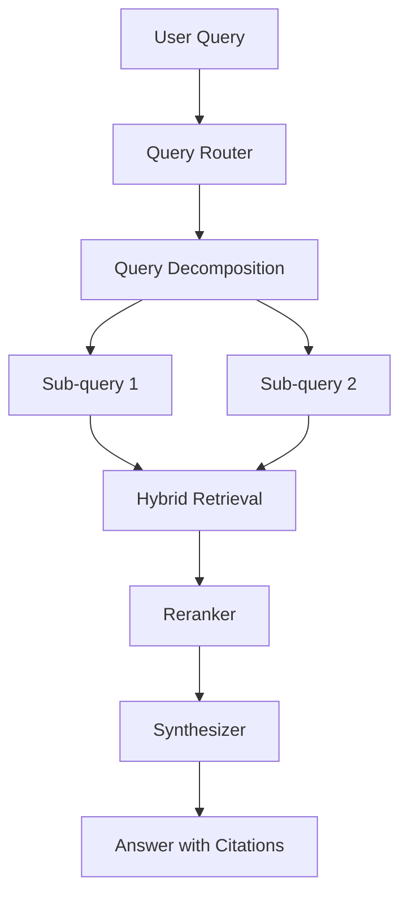

# RAG Architecture for Market Research Intelligence

## High-Level Overview

```mermaid
flowchart TD
    Q[User Query] --> QR[Query Router]
    QR --> QD[Query Decomposition]
    QD --> SQ1[Sub-query 1]
    QD --> SQ2[Sub-query 2]
    SQ1 --> HR[Hybrid Retrieval]
    SQ2 --> HR
    HR --> RR[Reranker]
    RR --> SYN[Synthesizer]
    SYN --> A[Answer with Citations]
```
